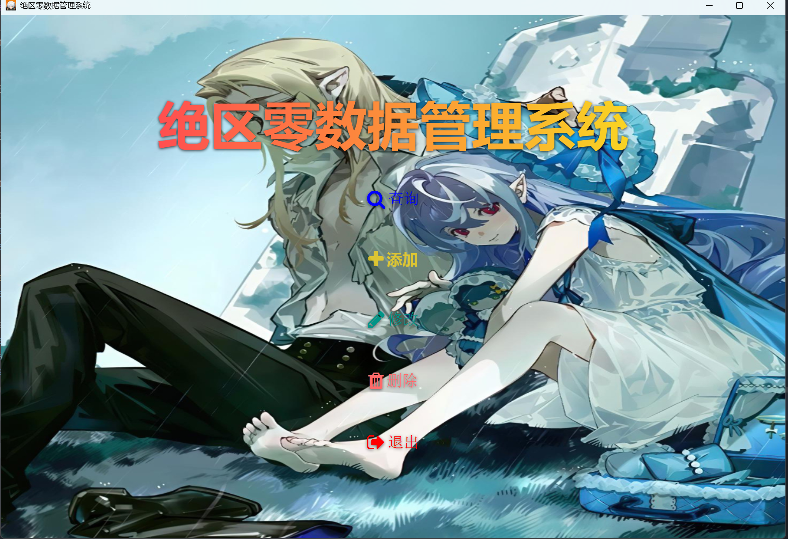

# 绝区零数据管理系统 🌐

> 项目概述
这是一个基于JavaFX的绝区零游戏数据管理系统，提供对游戏角色、武器和驱动盘数据的增删改查功能。系统采用MVC架构，使用MySQL数据库存储数据。

## ✨功能模块
1. 主界面

   提供查询、添加、修改、删除和退出功能入口

   美观的渐变标题和按钮样式

   统一的背景图片和图标

2. 添加模块

   支持添加角色、武器和驱动盘数据

   动态表单：根据选择类型显示不同字段

   数据验证和错误提示

3. 查询模块

   可按ID或名称查询

   表格展示查询结果

   角色查询显示图片预览

4. 修改模块

   根据ID修改已有数据

   动态表单适配不同类型数据

   数据验证和操作反馈

5. 删除模块
   支持按ID或名称删除

📋技术栈

  JavaFX + mysql

🎯数据库设计
  系统使用三个主要表：

  characters - 存储角色数据

  weapons - 存储武器数据

  artifacts - 存储驱动盘数据

## 🏗️项目结构

AddInterface.java           # 添加界面

ArtifactDao.java            # 驱动盘数据访问

ArtifactEntity.java         # 驱动盘实体

CharacterDao.java           # 角色数据访问

CharacterEntity.java        # 角色实体

DatabaseConnection.java     # 数据库连接

DeleteInterface.java        # 删除界面

Main.java                   # 主界面

ModifyInterface.java        # 修改界面

QueryInterface.java         # 查询界面

UIUtils.java                # UI工具类

WeaponDao.java              # 武器数据访问

WeaponEntity.java           # 武器实体

xuan.jpg                    # 背景图片

Main.png   #主界面截图

zzz.png                     # 应用图标

zzz.sql zzz.txt      #数据库创建文件

## 📚使用说明

环境要求
Java 21+   MySQL 5.7+  Maven

🖥️数据库配置

使用zzz.sql或者zzz.txt创建数据库，并导入数据

修改DatabaseConnection.java中的连接信息

🧩项目特色

美观的UI设计：使用阴影效果和动画

动态表单：根据选择的数据类型自动调整输入字段

完善的错误处理：数据库操作异常捕获和用户提示

图片支持：角色查询可显示关联图片

🎮 使用截图

🤝 参与贡献  
欢迎通过以下方式改进项目：  
提交Issue报告问题  
发起PR贡献代码  

📜 开源协议  
本项目采用 MIT License  
允许自由使用和修改

📧 维护者：1350747489@qq.com  
🌍 项目主页：https://github.com/xuan0331/zzz
